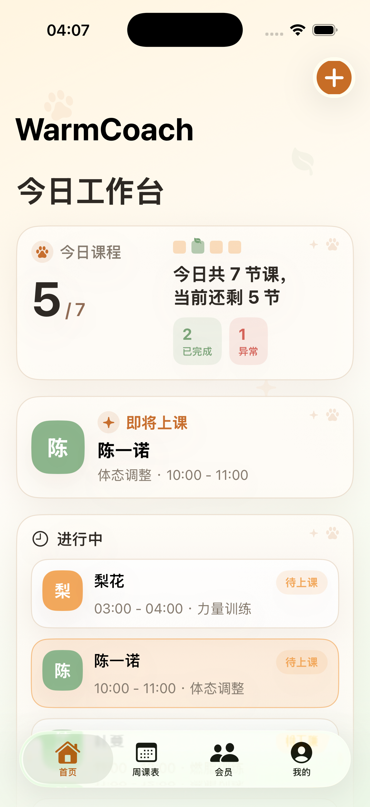
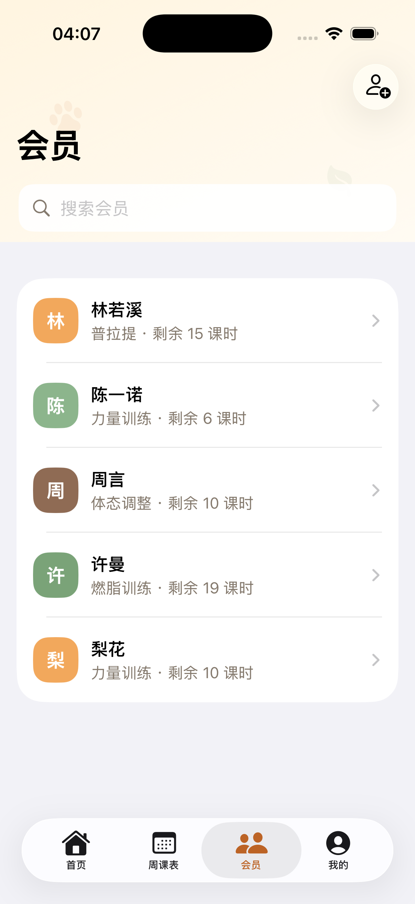

# WarmCoach 使用说明

WarmCoach 是一款面向私教和小型健身工作室的 iOS 排课 App，用来记录会员、课程时间、课程状态和课前提醒。它的设计目标是让每天的课程安排一眼看清，常用操作尽量少点几步。

## 首页

首页是每天打开 App 后最常用的工作台。

- 右上角 `+`：新增排课。
- 今日课程：显示今天总课数、剩余待上课程、已完成课程和异常记录。
- 即将上课：显示下一节即将开始的课程。
- 进行中：显示今天还未完成的课程卡片。
- 取消和异常：显示今天取消、请假、爽约的课程记录，点标题右侧「全部」可查看历史记录。

点击「进行中」里的课程卡片，可以选择：

- 已完成
- 已取消
- 请假
- 爽约
- 编辑课程

已完成课程会从首页「进行中」里消失，并计入今日已完成。

## 新增排课

新增课程控制在三步内完成：

1. 选择会员。
2. 选择日期、起止时间和课程类型。
3. 确认提醒规则并保存。

默认规则：

- 起始时间会自动排在当前已有课程之后。
- 结束时间默认比起始时间晚 90 分钟。
- 提醒默认提前 30 分钟。
- 新增课程状态默认为「待上课」。

如果同一时间段已有课程，系统会提示冲突，避免重复排课。

## 周课表

周课表用于按周查看课程分布。

- 默认打开时会把今天这一列居中显示。
- 今天的列宽更宽，方便查看当天课程。
- 顶部可切换上一周、下一周。
- 支持搜索会员姓名，匹配文字会高亮。
- 右上角「切换」可切换到时间网格视图。

颜色含义：

- 暖黄色：待上课。
- 柔绿色：已完成。
- 已取消、请假、爽约不会显示在周课表中。

## 会员页

会员页用于管理会员资料和查看会员详情。

会员列表展示：

- 会员头像
- 姓名
- 课程类型
- 剩余课时

可通过顶部搜索框快速查找会员。点右上角新增会员，点会员行进入详情。

会员详情中可以查看和编辑：

- 姓名
- 联系方式
- 课程类型
- 剩余课时
- 默认提醒
- 备注
- 历史课程

联系方式支持长按复制。

## 编辑课程

在首页点击课程卡片后选择「编辑课程」，会进入独立的课程编辑页面。

可编辑内容包括：

- 会员
- 日期
- 开始时间
- 结束时间
- 课程类型
- 提醒规则
- 备注

保存时仍会进行时间冲突检测。

## 课程状态

当前支持的课程状态：

- 待上课
- 已完成
- 已取消
- 请假
- 爽约

状态规则：

- 已完成会消耗会员剩余课时。
- 取消、请假、爽约会进入首页「取消和异常」。
- 取消和异常记录可长按恢复课程。
- 如果恢复时原时间段已被占用，系统会提示并进入新建课程，方便重新选择时间。

## 我的

「我的」用于查看工作室数据和基础设置。

个人中心展示：

- 活跃会员数
- 本周课程数
- 会员剩余课时合计

点击数字可查看对应详情：

- 活跃：查看仍有课时的会员。
- 本周：以时间网格查看本周课程。
- 课时：查看所有会员剩余课时排行。

工作室设置中可以维护课程类型，新增后会出现在会员和排课页面中。

## 通知提醒

WarmCoach 使用 iOS 本地通知，不需要服务器。

首次打开 App 时：

- 如果通知权限已开启，不会提示。
- 如果还没选择权限，会提示开启课程提醒。
- 如果曾经拒绝权限，会提示去系统设置开启。

当前通知内容为课程开始前提醒：

- 标题：课程即将开始
- 内容：会员姓名、课程时间、课程类型

只有「待上课」状态的未来课程会发送提醒。

## 数据存储

当前版本数据保存在本机：

- 会员资料
- 排课记录
- 课程类型
- 课程状态

一个人使用不需要服务器。后续如果需要多设备同步，可以再考虑 iCloud 同步。

## 使用建议

- 每天先看首页，确认即将上课和进行中的课程。
- 上完课后及时把课程标记为「已完成」。
- 会员请假或爽约时，在课程卡片里直接标记状态。
- 每周排课时使用周课表，课程较多时切换到时间网格视图查看密度。
- 会员续课后，在会员详情里更新剩余课时。
